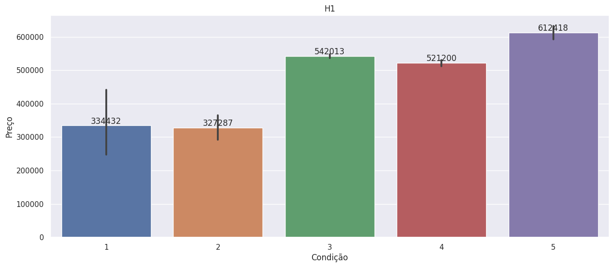
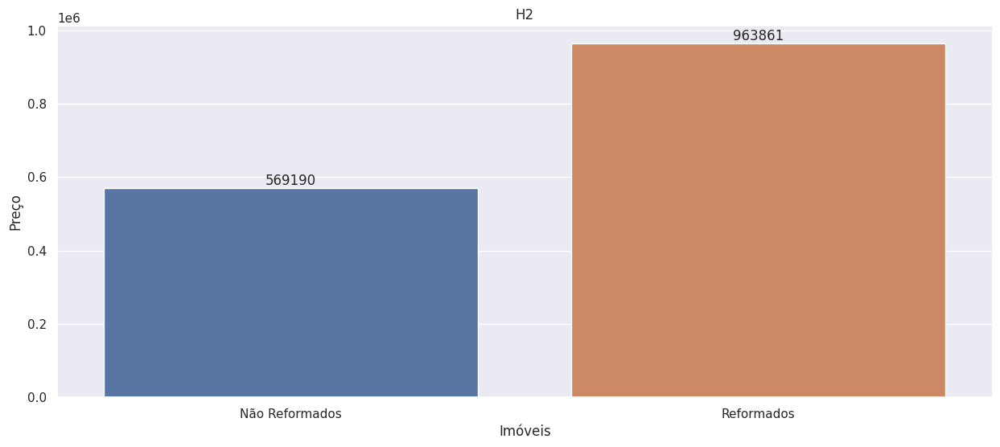
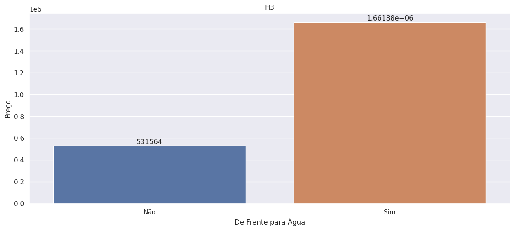
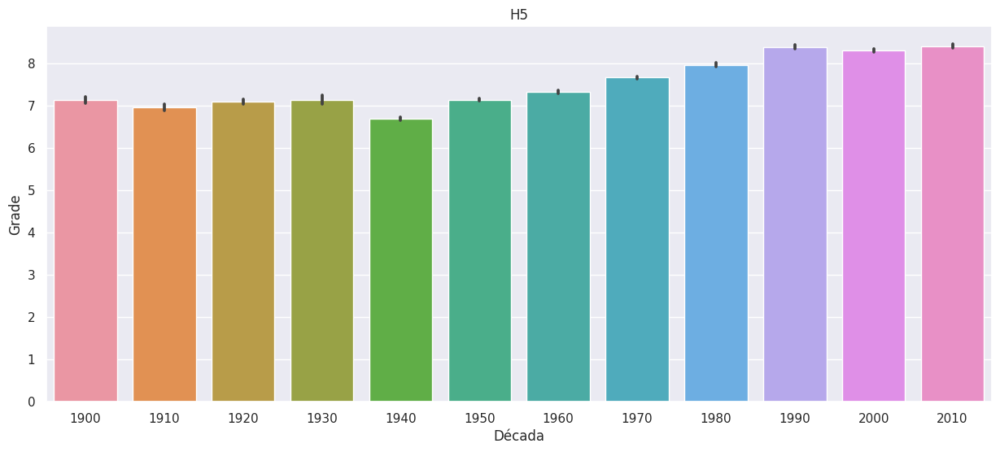
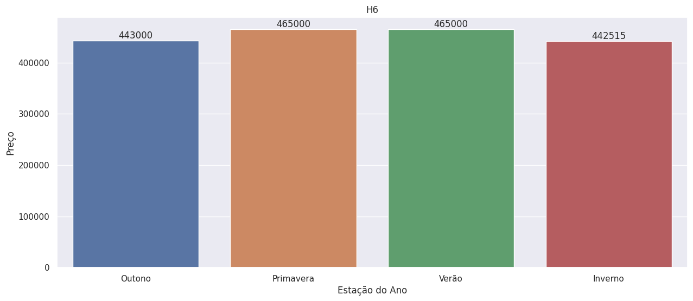

# Northwest Real Estate Agency

# Welcome to my portfolio project for the fictional company Northwest Real Estate Agency.
###### [View Project](https://ricardoffdev-nrea-project-dashboard-muvf30.streamlit.app/)

## 1. Business Problem

In this business project, I will analyze a real estate database. This public database was provided by the Kaggle data science competition website.
Northwest Real Estate Agency aims to buy and sell properties in the city of Seattle. To achieve the desired profit in property transactions, the company requires accurate analysis of all relevant information.

## 1.1 Business Context

This database contains 21,613 entries from May 2, 2014, to May 27, 2015. All entries represent unique properties in Seattle, located on the Pacific coast of the USA.

## 1.2 Business Questions

- Estimate the best purchasing options and their respective values.
- After acquiring a property, determine the profit margin for the sale.

## 2. Pre-planning

## 2.1 Tools, IDEs, and Libraries

- Python 3.10
- Visual Studio Code
- Jupyter Notebook
- PyCharm Community Ed.
- Libraries: Seaborn, Plotly, Plotly Express, Pandas, Numpy, Folium, Geopandas, Streamlit-Folium, and Streamlit
- Final deployment: Streamlit Web Apps

## 2.2 Final Product

A web page with the following information:
- Solve the six main insights.
- Provide purchasing suggestions for properties.
- Suggest selling prices for acquired properties.

## 3.0 Business Study

The Seattle Real Estate Market is highly competitive according to sources from [Redfin](https://www.redfin.com/city/16163/WA/Seattle/housing-market), houses in Seattle receive an average of two offers for sale every 14 days. In the Seattle real estate market, the average monthly transaction value is $843,000. This value has been growing at an average rate of 7.3% per year. The average sale price per square foot in Seattle is $555, based on data from the past year.

## 4.0 Data

The data used in this project was obtained from a publicly available dataset provided by [Kaggle](https://www.kaggle.com/datasets/harlfoxem/housesalesprediction).

### 4.1 Source Attributes

The following are the attributes included in the dataset:

| Column        | Description                                                       |
|:--------------|-------------------------------------------------------------------|
| id            | Unique identifier for each property                                |
| date          | Sale date                                                          |
| price         | Sale price                                                         |
| bedrooms      | Number of bedrooms                                                 |
| bathrooms     | Number of bathrooms                                                |
| sqft_living   | Square footage of the living area                                  |
| sqft_lot      | Square footage of the lot                                          |
| floors        | Number of floors                                                   |
| waterfront    | Indicator of whether the property has a waterfront view            |
| view          | Property view measured on an index                                 |
| condition     | Property condition measured on an index                            |
| grade         | Grade given to the property based on the King County grading system|
| sqft_above    | Square footage above the basement                                   |
| sqft_basement | Square footage of the basement                                      |
| yr_built      | Year of construction                                               |
| yr_renovated  | Year of the last renovation                                        |
| zipcode       | Postal code                                                        |
| lat           | Latitude                                                           |
| long          | Longitude                                                          |
| sqft_living15 | Square footage of the living area for the fifteen closest neighbors|
| sqft_lot15    | Square footage of the lot for the fifteen closest neighbors        |

## 4.2 Source Attribute Details

* waterfront: 0 = no, 1 = yes
* view: 0 = No view, 1 = Poor, 2 = Average, 3 = Good, 4 = Excellent
* yr_renovated: year of renovation or '0' if never renovated
* bathrooms: In the USA, full bathrooms must have four plumbing fixtures. A full bathroom contains at least one sink, one toilet, one shower, and one bathtub. A bathroom appearing as 0.5 represents a bathroom with a toilet and a sink, while a 0.75 bathroom is one that contains a sink, a toilet, and a shower or bathtub.
* condition: 
   - 1 = Worn-out. Repairs and revisions needed on painted surfaces, coverings, plumbing, heating, and numerous functional deficiencies.
   - 2 = Very worn-out. Requires significant repairs.
   - 3 = Average. Some evidence of deferred maintenance and normal obsolescence with age, as some minor repairs are needed along with some touch-ups.
   - 4 = Good. No obvious maintenance required, but also not everything is new.
   - 5 = Very good. All items well maintained, many of which have been renovated and repaired as they showed signs of wear, increasing the lifespan and reducing the effective age with little deterioration or obvious obsolescence, with a high degree of utility.
* grade: (1-3): Below minimum building standards.
   - 4: Generally older, lower-quality construction.
   - 5: Low-cost construction and labor. Small and simple design.
   - 6: Lowest grade currently meeting building code. Low-quality materials and simple architectural design.
   - 7: Has an average level of construction and design.
   - 8: Slightly above average in construction and design. Usually better materials in both exterior and interior finishing work.
   - 9: Better architectural design with extra design and quality on both the interior and exterior.
   - 10: Homes of this quality have generally high-end features. Finishing work is better and more quality design is seen in floor plans. Usually larger in size.
   - 11: Custom design and higher-quality finishings with added amenities of solid woods, bathrooms, and more luxurious options.
   - 12: Custom design and excellent builders. All materials are of the highest quality, and all conveniences are present.
   - 13: Generally designed and built to custom specifications. Mansion-level. Extensive high-quality cabinetry, wood finishes, marble, entryway forms, etc.

## 4.3 Created Attributes

|     COLUMN      | DESCRIPTION                                                                  |
|:---------------:|------------------------------------------------------------------------------|
| date_str        | Sale date in Day/Month/Year format                                           |
| year            | Year of property sale                                                        |
| month           | Month of property sale                                                       |
| seasons         | Season of the year when the property was sold                                |    
| living_m2       | Size (in square meters) of the interior space (built area) of the properties |
| lot_m2          | Size (in square meters) of the land where the property is located            |
| above_m2        | Size (in square meters) of the interior space above ground level             |
| age             | Age of the property. (Current Year - Year Built)                             |
| renovated       | Yes if the property has been renovated, and No otherwise                     |
| price_m2        | Price of the property per total area in square meters                        |

## 4.4 Details of Created Attributes

Seasons (seasons):

Summer = June to August.
Autumn = September to November.
Winter = December to February.
Spring = March to May.

m2_living, m2_lot, and m2_above:
Conversion from square feet (sqft) to square meters (m²).

price_m2 = price / (living_m2 + lot_m2 + above_m2)
Analyzing the price of the property based on its built area.

## 5. Assumptions

Missing Data: None of the dataset attributes have missing data.

Duplicate Properties: There are 177 properties that are duplicated in the dataset, meaning they were sold more than once in different periods throughout the data collection period.

Outlier Value for Number of Bedrooms: There is a single property with 33 bedrooms, but upon cross-referencing data, such as the total land size of this property, it was determined that this data is inaccurate. Additionally, other properties with similar price range, internal size, number of bathrooms, and floors were analyzed, and the average number of bedrooms in those properties was 2.98.

Properties with Zero Bedrooms or Zero Bathrooms: There are 16 properties with zero bedrooms or zero bathrooms in the database. It is assumed that these properties are correct and will not be excluded since they may not be intended for residential use.

## 6. Top Six Insights

#### H1: Properties with a condition level greater than or equal to 3 are 20% more expensive on average.
   - False:
   Properties in categories 3, 4, and 5 cost, on average, 153.22% more.

#### H2: Properties up to 50 years old that have been renovated are 20% more expensive on average compared to non-renovated properties.
   - False:
   Considering the average price, instead of being 20% more expensive, renovated properties up to 50 years old are 69.33% more expensive.

#### H3: Properties with a waterfront view are 30% more expensive on average.
   - False:
   Considering the average price, instead of being 30% more expensive, properties with a waterfront view cost 212.63% more on average.

#### H4: Properties with a construction date before 1955 are 50% cheaper on average.
   - False:
   Considering the average price, properties with a construction date before 1955 are only 1.09% cheaper.

#### H5: Are properties from the last few decades more valuable?
   - True:
   The evaluation of properties built in the last three decades is, on average, about 19% higher than the evaluation of properties built between 1900 and 1959, with an average growth of 4.7% per decade between the 1940s and 1990s.

#### H6: Does the median value of properties vary by 20% according to the season?
   - False:
   Considering the largest variation in the median price, the highest percentage increase was found from winter to spring, where the median price was 8.13% higher.

## 7. Business Questions

The business questions have been addressed through analytical reasoning and exploratory data analysis (EDA).

Which properties should the Northwest Real Estate Agency buy and at what price?

The properties have been grouped by region (zipcode), and within each region, the median prices per built area have been determined. I will suggest purchasing properties that have prices below the region's median, are in good condition (condition >= 3), have one or more bathrooms and bedrooms, and have a grading of 7 or higher.

All properties that meet these purchase filters will be compiled into a list. Within this list, I have identified the top two priority properties for acquisition, as they have 'Water View'.

Once a property has been purchased, at what price should it be sold, and when is the best time to sell?

I will group the properties by region (zipcode) and by season of the year. Within each region and season, I will calculate the price median. Then, I will calculate the percentage of profit based on the purchased properties. This will provide a clear understanding of the selling price and the resulting profit.

Please note that the translations have been provided in Markdown format for easy formatting and readability. You can copy and paste the translated text as needed.

## 8.0 Conclusion

The initial objectives have been achieved regarding the list of recommended properties for purchase and the projection of their selling prices. Additionally, the analysis of the dataset allowed us to answer the 6 key insights. Lastly, all the results have been presented in a cloud-based application, which facilitates access to the obtained outcomes.

Regarding the results, it is evident that the "built area" attribute strongly influences the property value. Therefore, efforts were made to minimize its impact when comparing it with other attributes, thus avoiding bias in the analysis.

This project serves as another example of the importance of using data to assist business teams in decision-making processes within the company. Furthermore, it highlights that, in addition to the usual technological and statistical tools, knowledge from various fields can impact the quality of data analysis.

Additionally, generating insights can lead to new questions or further analyses, strengthening the collaboration between business and data teams.

## 9.0 Next Steps

1. Utilize Machine Learning algorithms to estimate the purchase and selling prices.
2. Employ clustering techniques to conduct comparative analyses of properties.
   
Another important step is sharing. All generated insights should be shared with other teams within the company. This way, the company as a whole can strive for and achieve new horizons. Any new idea that sparks discussions and contradictions in projects is always welcome. After all, the more knowledge is shared, the better the results achieved.

